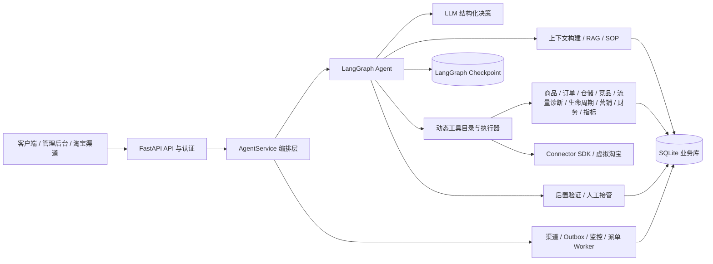

# 云湃电商一体机 Agent

一个面向本地一体机的轻量电商经营 Agent。业务按商品、订单、仓储、竞品、营销、财务、指标和客服拆分模块；LLM 在 LangGraph 中负责理解目标、选择工具并根据 Observation 继续规划，固化代码负责事实、权限、指标、幂等、后置验证、RAG、自进化、审计和人工接管。默认以 `MODEL_ENABLED=false` 安全启动。

## 当前进度与开发分支

截至 2026-09-04，本 README 以 GitHub `main` 的功能合并基线
[`b77dfeb`](https://github.com/a1024053774/yunpai-ecommerce-agent/commit/b77dfeb97583084214afc726ade367f3a7d99cea)（[PR #19](https://github.com/a1024053774/yunpai-ecommerce-agent/pull/19)）为准。`main` 已包含 M9-R 的商品经营读模型、流量诊断与受控实验、生命周期建议和只读经营工作台等增量；真实平台接入、生产发布、长稳和权限 Gate 仍需按验收文档单独确认。

下面是当前主要开发方向的快照。表中未合入 `main` 的分支不属于 `main` 的能力承诺；分支是否开放、可合并或已合入，以 GitHub 的 PR 和分支页面为准。

| 分支 / PR | 当前开发方向（2026-09-04 快照） | 入口 |
| --- | --- | --- |
| `main` | 已合入能力的集成与验收基线，最新功能合并为 M9-R | [main](https://github.com/a1024053774/yunpai-ecommerce-agent/tree/main) · [PR #19](https://github.com/a1024053774/yunpai-ecommerce-agent/pull/19) |
| `codex/1688-a1-p1-main` | 1688 渠道可用性持久化与可恢复分页同步 | [PR #27](https://github.com/a1024053774/yunpai-ecommerce-agent/pull/27) |
| `codex/1688-a1-p1-api` | 1688 API / Connector 配套实现与同步路径验证 | [分支](https://github.com/a1024053774/yunpai-ecommerce-agent/tree/codex/1688-a1-p1-api) |
| `feature/m8r-customer-service-loop` | M8-R 销售与售后客服闭环 | [PR #25](https://github.com/a1024053774/yunpai-ecommerce-agent/pull/25) |
| `feature/m10r-wp4-profit-ledger` | M10-R 预测补货、订购单草稿与利润账本 | [PR #24](https://github.com/a1024053774/yunpai-ecommerce-agent/pull/24) |
| `codex/m8r-qwen-polish` | 单图多模态客服、跨轮记忆与媒体隐私打磨 | [分支](https://github.com/a1024053774/yunpai-ecommerce-agent/tree/codex/m8r-qwen-polish) |
| `demo/main-multimodal-product-demo` | 统一 Agent 多模态产品演示与部署说明 | [分支](https://github.com/a1024053774/yunpai-ecommerce-agent/tree/demo/main-multimodal-product-demo) |
| 工作区 PR #9/#11/#12 | 统一工作区、会话持久化与复合查询（草稿 PR） | [PR #9](https://github.com/a1024053774/yunpai-ecommerce-agent/pull/9) · [PR #11](https://github.com/a1024053774/yunpai-ecommerce-agent/pull/11) · [PR #12](https://github.com/a1024053774/yunpai-ecommerce-agent/pull/12) |

未列出的远程分支主要是历史验收或合并辅助分支。需要核对实时状态时，请查看 [开放 PR](https://github.com/a1024053774/yunpai-ecommerce-agent/pulls) 和 [全部分支](https://github.com/a1024053774/yunpai-ecommerce-agent/branches)；本表不替代项目验收、发布或权限 Gate。

## 系统结构



## 核心能力

- LLM 驱动链路：认证、会话绑定、输入脱敏、RAG 上下文、结构化决策、通用路由、动态工具目录、有界 ReAct、后置验证和持久化。
- 内置电商问法与对抗样例覆盖商品、库存、价格、活动、支付、订单、发货、物流、退换、退款、投诉、隐私和安全；具体清单以代码注册表与验收文档为准。
- 受控自进化：负反馈和证据来源生成租户级候选话术，经过安全、检索碰撞和回归门禁、管理员批准后才进入线上知识库，并可回滚。
- 学习效果回归：三轮隔离实验验证目标问法从旧答案切换到已批准答案，同时保持离线信任边界、检索与安全基线全通过。
- 低成本复用：高置信度的人工批准进化答案可直接通过后置安全门返回，不再重复调用模型。
- 模型能力约束：模型选择 `answer/clarify/observe/act/handoff/refuse/finish` 和已注册工具，但不拥有权限放行、幂等、业务规则或成功判定权。
- 工具契约：写工具必须声明输入模型、幂等字段和后置验证器；未注册工具、缺失参数或规则拒绝不会被模型绕过。
- 可信边界：API 客户端密钥、租户/用户会话绑定、授权上下文能力标记。
- 可执行人工交接：任务具备 `proposed` 到 `completed/failed/canceled` 的合法状态迁移和乐观锁版本。
- 管理面身份：管理员独立 ID/密钥，操作人不再由请求正文自报。
- 运行门禁：请求限流、正文大小限制、独立 `/ready` 和磁盘余量检查。
- 本地可审计：checkpoint、知识版本、脱敏会话、决策轨迹、指标和进化操作均落 SQLite。
- 统一 Connector SDK：能力声明、连接检查、拉取、Webhook 验证、动作执行和读回验证使用同一契约。
- 淘宝虚拟接口：本地完成数据拉取、Webhook、幂等动作和回执验证，不访问淘宝网络，不伪装真实授权。
- 商品事实：SPU/SKU、渠道商品状态、售价、属性、来源时间、载荷哈希和版本按租户持久化，拒绝旧版本和同版本冲突。
- 订单事实：订单行、脱敏买家引用、物流快照、售后单和不可变版本历史在同一事务内更新，不执行退款或赔付。
- 仓储管理：库存余额、可售库存、覆盖天数、缺货/滞销判断和补货建议，保留来源、时间和版本证据。
- 商品经营闭环：`main` 已包含商品经营读模型、流量诊断、受控实验、生命周期建议和只读经营工作台；建议仍需人工确认，不触发平台写动作。
- 受控指标：指标定义由代码注册表统一维护，查询只接受严格 `QuerySpec`，返回定义版本、数据水位、质量与证据数量。
- 虚拟店铺验收：内置“晴川生活电器旗舰店”关联数据包，覆盖商品、库存、订单、竞品、知识和客服等跨域场景；场景清单、模块状态和运行结果以业务模块注册表、fixture 与验收文档为准，所有虚拟数据明确禁止作为生产数据证据。
- 经营 Agent 工具：商品、订单、库存、竞品和经营指标等只读工具由动态注册表暴露；订单工具同时绑定可信订单号与店铺号。
- 工具执行器：实际执行超时、只读异常重试、写超时不确定态和后置条件失败降级，不再把元数据当作空声明。
- 分层知识治理：平台、行业、店铺、商品和进化知识支持店铺/SKU 范围、不可变内容版本、评测、批准、停用和回滚，Agent 只检索当前范围内的已批准版本。
- SOP 执行引擎：类型化 DSL 覆盖稳定步骤 ID、必需可信上下文、读取、评估、提案、动作、人工审批、重试上限、补偿工具和后置条件；版本按 `draft -> evaluated -> approved -> active -> retired` 发布。会话固定启动版本并逐步持久化执行状态，重启时只安全恢复读取，写入和补偿中断必须人工核对。
- 质检与 VOC：代码化规则区分证据缺失、模型降级、漏转人工、敏感信息、渠道发送和高风险回复；结果必须人工确认或驳回，不自动修改线上规则。
- 客服操作闭环：渠道会话使用所有权乐观锁，支持暂停、人工接管、恢复、建议改写、结构化 diff 和草稿幂等发送；暂停后的自动发送会被发送前二次检查拦截。
- 可靠发送：API 先把加密载荷写入 SQLite outbox，再由带租约的 worker 逐条派发；连接建立失败按指数退避重试并进入死信，进程在外呼后中断则标记 `uncertain`，未经人工核对不会重发。
- 发送结果治理：`confirmed/rejected/uncertain/dead_letter/cancelled` 都保留尝试次数、错误类型、乐观锁版本、核对人和说明；出站事件同步进入渠道会话时间线，后台可查看积压并确认已送达或未投递后重排。
- 发布门禁：每个店铺的客服策略按不可变版本发布，使用隔离数据库快照执行真实 Agent 回放；通过后再审批、启用和稳定哈希分流，支持影子、仅提示、人机协同和白名单自动四种模式。
- 运行熔断：发布策略同时约束意图白名单、最高风险、证据、模型降级、回放失败率和运行错误预算；严重回答或渠道投递失败会记录观测并自动暂停策略。
- 客户 Agent 评测：脱敏标注集按不可变版本冻结并计算数据集哈希；在隔离数据库快照中运行实际多轮 Agent，统计意图、转人工、证据、严重错误和跨版本回归，可直接作为发布审批证据。
- 持久渠道 Agent：奇门入站事件和 Agent 任务同事务落库；worker 以租约恢复执行，Agent 调用按事件幂等，影子/辅助/协同/自动四种模式分别落观测、草稿、人工任务或可靠发送箱。
- 渠道运行账本：逐事件记录发布版本、分桶、执行阶段、尝试次数、回答、上下文证据和下游结果；异步投递拒绝、不确定态和死信会反写发布观测并触发错误预算。
- 双人复核：人机协同和自动回复策略不能由创建人自行审批；管理员凭据只保存派生哈希，可在后台创建和停用复核员。
- 加密灾备：业务库与 checkpoint 库通过 SQLite online backup 形成一致快照集，清单和数据库整体使用 AES-256-GCM 认证加密；CLI 支持完整验证、覆盖保护、恢复回滚、密钥轮换和 dry-run 优先的保留清理。
- 单实例运行锁：同一数据目录只能由一个 Agent 服务占用；在线备份允许并发读取，恢复、回滚和第二个服务启动会被互斥锁拒绝。

## 快速启动

PowerShell：

```powershell
py -3.12 -m venv .venv
.\.venv\Scripts\Activate.ps1
python --version
python -m pip install -e ".[dev]"

$env:ADMIN_API_KEY = "请替换为长随机密钥"
$env:ADMIN_AUTH_REQUIRED = "true"
$env:BOOTSTRAP_ADMIN_ID = "local-admin"
$env:AUTH_REQUIRED = "true"
$env:BOOTSTRAP_TENANT_ID = "local-appliance"
$env:BOOTSTRAP_CLIENT_ID = "local-adapter"
$env:BOOTSTRAP_CLIENT_KEY = "请替换为另一条长随机密钥"
$env:SUBJECT_HASH_KEY = "请替换为稳定的随机 HMAC 密钥"
$env:MODEL_PROVIDER = "glm"
$env:MODEL_BASE_URL = "https://open.bigmodel.cn/api/paas/v4"
$env:MODEL_NAME = "glm-4.7-flash"
$env:MODEL_API_KEY = "请使用具备标准 API 资源的密钥"
$env:MODEL_ENABLED = "true"

yunpai-agent init
yunpai-agent eval
yunpai-agent simulate-store
yunpai-agent model-probe
yunpai-agent serve --host 127.0.0.1 --port 8080
```

必须确认 `python --version` 为 3.11 或更高，且 `Get-Command yunpai-agent` 指向当前虚拟环境。安装了多个 Python 的 Windows 主机如果尚未激活虚拟环境，应使用 `py -3.12 -m ecommerce_agent.cli <command>`，避免误调用旧解释器残留的同名脚本。

macOS / Linux（bash/zsh）：

```bash
python3.11 -m venv .venv
source .venv/bin/activate
python --version
python -m pip install -e ".[dev]"

export ADMIN_API_KEY="请替换为长随机密钥"
export ADMIN_AUTH_REQUIRED="true"
export BOOTSTRAP_ADMIN_ID="local-admin"
export AUTH_REQUIRED="true"
export BOOTSTRAP_TENANT_ID="local-appliance"
export BOOTSTRAP_CLIENT_ID="local-adapter"
export BOOTSTRAP_CLIENT_KEY="请替换为另一条长随机密钥"
export SUBJECT_HASH_KEY="请替换为稳定的随机 HMAC 密钥"
export MODEL_PROVIDER="glm"
export MODEL_BASE_URL="https://open.bigmodel.cn/api/paas/v4"
export MODEL_NAME="glm-4.7-flash"
export MODEL_API_KEY="请使用具备标准 API 资源的密钥"
export MODEL_ENABLED="true"

yunpai-agent init
yunpai-agent eval
yunpai-agent simulate-store
yunpai-agent model-probe
yunpai-agent serve --host 127.0.0.1 --port 8080
```

必须确认 `python --version` 为 3.11 或更高，且 `which yunpai-agent` 指向当前虚拟环境（`<项目根>/.venv/bin/yunpai-agent`）。系统自带的 `/usr/bin/python3` 通常低于 3.11，请改用 Homebrew 等安装的 `python3.11`/`python3.12` 创建虚拟环境；未激活虚拟环境时可用 `./.venv/bin/python -m ecommerce_agent.cli <command>` 显式调用。

`MODEL_ENABLED=false` 时不会发出模型网络请求；除完全匹配且经过人工批准的进化答案外，需规划的请求会安全建单转人工。模型、检索、输出预算和重试策略以运行时配置与代码中的权威定义为准；`MODEL_MOCK_MODE=true` 仅供自动化测试和离线演示。

GLM Coding Plan 可作为显式的本机测试模型，通过标准 Chat Completions 接口接入；配置 `/api/coding/` 时需设置 `MODEL_ALLOW_CODING_PLAN=true`，并使用非流式调用。正式环境默认仍使用标准 GLM API。详见 [GLM 接入说明](docs/glm-integration.md)。

当前实现和最新交付边界优先查看 [M9-R 交付与验收证据包](docs/works/15-feature-m9r-lifecycle/README.md)、[M9-R 完整执行计划](docs/plans/m9r-complete-plan.md)、[项目版本](.project-to-act/PROJECT_VERSIONS.md) 和 [项目验收](.project-to-act/PROJECT_ACCEPTANCE.md)。虚拟店铺、自动派单和历史候选材料仍保留在 `docs/`，但其中的测试数字只代表对应日期和提交的历史证据。

## API 示例

普通咨询：

```powershell
$body = @{
  session_id = "shop-a:buyer-1001"
  message = "退款多久到账？"
  context = @{ platform = "demo" }
} | ConvertTo-Json

Invoke-RestMethod -Method Post -Uri http://127.0.0.1:8080/v1/chat `
  -Headers @{
    "X-Client-Id" = "local-adapter"
    "X-Client-Key" = "上游客户端密钥"
    "X-Subject-Id" = "平台侧稳定买家标识"
  } -ContentType "application/json" -Body $body
```

只有可信上游服务可以提供授权订单上下文：

```json
{
  "session_id": "shop-a:buyer-1001",
  "message": "我的包裹到哪里了？",
  "context": {
    "platform": "authorized-adapter",
    "shop_id": "shop-a",
    "order_id": "order-1001",
    "order_status": "已发货",
    "logistics_status": "运输中",
    "carrier": "示例快递",
    "tracking_last_event": "已到达分拨中心"
  }
}
```

请求正文中的 `authorized` 会被忽略。只有数据库中 `can_supply_order_context=1` 的认证客户端，才会由服务端写入可信授权标记。

管理端通过 `X-Admin-Id` 和 `X-Admin-Key` 管理人工任务、指标、留存清理和进化候选。仅本机临时联调时可设置 `ADMIN_AUTH_REQUIRED=false` 免登录；该模式只接受回环客户端，且 `serve` 会拒绝监听非回环地址。客户侧 `AUTH_REQUIRED` 不受影响。留存任务默认 dry-run，可用 `yunpai-agent retention --apply` 正式执行。完整接口可在启动后打开 `/docs` 查看。

管理员也可以通过 `GET /v1/simulations/virtual-store` 查看内置数据包摘要，并向 `POST /v1/simulations/virtual-store/run` 提交 `{"confirm_virtual": true}` 执行跨模块验收。该入口只写入当前管理员租户，所有来源都标记为 `virtual` 或 `is_estimate=true`，不会访问外部平台，也不会执行退款、改价、采购或付款。

服务启动后打开 `http://127.0.0.1:8080/admin` 进入管理后台。页面使用相同的管理员身份调用 API，管理员密钥只保存在当前浏览器会话中；对话测试仍需要独立的可信客户端凭据。

生产默认 `OUTBOX_WORKER_ENABLED=true`、`OUTBOX_SYNC_DISPATCH=false`。发送 API 返回排队状态后由 worker 完成派发；`/ready` 会验证 worker 存活，`/health` 和渠道工作台暴露积压、待核对和死信数量。`OUTBOX_SYNC_DISPATCH=true` 只用于隔离联调和兼容测试。

生产默认 `CHANNEL_AGENT_WORKER_ENABLED=true`。奇门验签通过后，入站事件和 Agent 任务同事务写入；请求内后台任务只用于降低延迟，worker 才负责故障恢复。`/ready` 在启用渠道自动回复时验证 worker 存活，后台“渠道接待”页面提供任务汇总、运行账本和上下文证据入口。

生产默认 `COMPETITIVE_MONITOR_WORKER_ENABLED=true`，每 60 秒按租户重评竞品策略；可用 `COMPETITIVE_MONITOR_POLL_SECONDS` 调整周期。`/ready` 验证调度线程存活，`/health` 暴露累计周期、评估数量、最近运行时间和最近错误。

生产默认 `HANDOFF_SLA_WORKER_ENABLED=true`，每 30 秒扫描首响和解决时限；可用 `HANDOFF_SLA_POLL_SECONDS` 调整周期。首次响应超时形成 L1，解决超时形成 L2，重复扫描不会重复升级；`/ready` 验证线程存活，`/health` 暴露周期、升级数量和最近错误。

生产默认 `HANDOFF_DISPATCH_WORKER_ENABLED=true`，每 2 秒领取持久派单作业。worker 只选择凭据/档案有效、自动派单、心跳在线、班次内、目标队列有技能且未满载的坐席；无候选时作业等待并形成持久告警，坐席恢复后自动唤醒。租约、批量、错误预算和退避由 `HANDOFF_DISPATCH_*` 配置，处置步骤见[自动派单运维手册](docs/handoff-dispatch-runbook.md)。

生产默认 `RELEASE_GATE_REQUIRED=true`。启用淘宝自动回复后，如果目标店铺没有处于 `active` 的发布策略，`/ready` 返回 503，入站消息只落库和审计，不调用 Agent 或发送。策略数据集可通过后台运行，也可使用 CLI 执行；CLI 只输出统计和 SHA-256，不持久化原始问题或答案：

```powershell
yunpai-agent release-replay release-id .\replay-cases.json
```

生产必须配置独立备份存储和 32 字节随机密钥。备份可在线执行；恢复和回滚必须先停止服务：

```powershell
$env:BACKUP_DIR = "D:\yunpai-backups"
$env:BACKUP_KEY_ID = "appliance-2026-q3"
$env:BACKUP_ENCRYPTION_KEY = "URL-safe-base64-encoded-32-byte-key"

yunpai-agent backup
yunpai-agent backup --require-stopped
yunpai-agent backup-verify D:\yunpai-backups\yunpai-....ypbak
yunpai-agent backup-prune --keep 14
```

覆盖恢复、恢复回滚、归档换钥和密钥保管要求见[运维手册](docs/operations.md)。密钥不得作为 CLI 参数传入或与归档保存在同一设备。

当前经营模块和虚拟接口：

```text
GET  /v1/modules
GET  /v1/connectors/catalog
POST /v1/connectors/virtual_taobao/test
POST /v1/connectors/virtual_taobao/sync
POST /v1/catalog/items
GET  /v1/catalog/items
POST /v1/orders
GET  /v1/orders
GET  /v1/orders/{order_id}/history
GET  /v1/inventory/balances
GET  /v1/inventory/risks
POST /v1/competitive/observations
GET  /v1/competitive/observations
PUT  /v1/competitive/monitors
GET  /v1/competitive/monitors
POST /v1/competitive/monitors/evaluate-all
POST /v1/competitive/monitors/{monitor_id}/evaluate
GET  /v1/competitive/alerts
POST /v1/competitive/alerts/{alert_id}/transition
GET  /v1/competitive/overview
GET  /v1/competitive/analysis
GET  /v1/metrics/catalog
POST /v1/metrics/query
GET  /v1/handoffs
GET  /v1/handoffs/summary
GET  /v1/handoffs/queues
PUT  /v1/handoffs/queues/{queue_key}
GET  /v1/handoffs/operators
GET  /v1/handoffs/operators/{operator_id}
PUT  /v1/handoffs/operators/{operator_id}
POST /v1/handoffs/operators/{operator_id}/presence
POST /v1/handoffs/operators/{operator_id}/presence-sessions
POST /v1/handoffs/operators/{operator_id}/heartbeat
GET  /v1/handoffs/operators/{operator_id}/shifts
POST /v1/handoffs/operators/{operator_id}/shifts
POST /v1/handoffs/operators/{operator_id}/shifts/recurring
POST /v1/handoffs/operators/{operator_id}/shifts/{shift_id}/cancel
GET  /v1/handoffs/dispatch/summary
GET  /v1/handoffs/dispatch/jobs
GET  /v1/handoffs/dispatch/alerts
POST /v1/handoffs/dispatch/run
POST /v1/handoffs/dispatch/jobs/{job_id}/retry
POST /v1/handoffs/dispatch/alerts/{alert_id}/acknowledge
POST /v1/handoffs/escalate-due
GET  /v1/handoffs/{handoff_id}/history
POST /v1/handoffs/{handoff_id}/claim
POST /v1/handoffs/{handoff_id}/assign-best
POST /v1/handoffs/{handoff_id}/transition
POST /v1/handoffs/{handoff_id}/reassign
POST /v1/handoffs/{handoff_id}/escalate
POST /v1/handoffs/{handoff_id}/notes
GET  /v1/admin/overview
GET  /v1/admin/conversations
GET  /v1/admin/conversations/{session_id}
GET  /v1/admin/audit
GET  /v1/admin/knowledge
POST /v1/admin/knowledge
POST /v1/admin/knowledge/{id}/evaluate|approve|retire|rollback
GET  /v1/admin/sops
POST /v1/admin/sops
POST /v1/admin/sop-versions/{id}/evaluate|approve|activate|retire|rollback
GET  /v1/admin/sop-runs
GET  /v1/admin/sop-runs/{run_id}
POST /v1/admin/sop-runs/{run_id}/steps/{step_id}/resolve
POST /v1/admin/sop-runs/{run_id}/steps/{step_id}/compensate
POST /v1/admin/qa/runs
GET  /v1/admin/qa/results
POST /v1/admin/qa/results/{id}/review
GET  /v1/admin/voc/overview
GET  /v1/admin/operators
POST /v1/admin/operators
POST /v1/admin/operators/{admin_id}/disable
GET  /v1/admin/releases
POST /v1/admin/releases
POST /v1/admin/releases/{id}/replay|approve|activate|pause|retire
GET  /v1/admin/releases/{id}/runtime
GET  /v1/admin/releases/{id}/observations
GET  /v1/admin/evaluations/overview
GET  /v1/admin/evaluations/suites
POST /v1/admin/evaluations/suites
GET  /v1/admin/evaluations/suites/{suite_id}
PUT  /v1/admin/evaluations/suites/{suite_id}/cases
POST /v1/admin/evaluations/suites/{suite_id}/freeze|versions|retire|runs
GET  /v1/admin/evaluations/runs
GET  /v1/admin/evaluations/runs/{run_id}
GET  /v1/integrations/taobao/conversations/{id}
POST /v1/integrations/taobao/conversations/{id}/ownership
POST /v1/integrations/taobao/conversations/{id}/reply-drafts
PATCH /v1/integrations/taobao/conversations/{id}/reply-drafts/{draft_id}
POST /v1/integrations/taobao/conversations/{id}/reply-drafts/{draft_id}/send
GET  /v1/integrations/taobao/outbox/summary
GET  /v1/integrations/taobao/outbox
POST /v1/integrations/taobao/outbox/run
POST /v1/integrations/taobao/outbox/{outbox_id}/reconcile
GET  /v1/integrations/taobao/agent-jobs/summary
GET  /v1/integrations/taobao/agent-jobs
GET  /v1/integrations/taobao/agent-jobs/{job_id}
POST /v1/integrations/taobao/agent-jobs/run
```

周期排班接口接收带 UTC 偏移的 `starts_at`、`ends_at`，以及
`repeat_every_weeks`（1–4）和 `occurrences`（2–26）。服务端将其展开为独立的
UTC 绝对班次；只要任一期与现有有效班次重叠，整批请求就会回滚。

### 营销与利润模块

```text
POST /v1/marketing/performance
GET  /v1/marketing/performance
POST /v1/marketing/diagnosis
POST /v1/marketing/content-drafts
GET  /v1/marketing/content-drafts
POST /v1/finance/expenses
GET  /v1/finance/expenses
POST /v1/finance/statements
GET  /v1/finance/statements
POST /v1/finance/profit
POST /v1/finance/reconciliation/run
GET  /v1/finance/reconciliation/tasks
POST /v1/finance/reconciliation/tasks/{task_id}/transition
```

营销只记录来源指标、诊断和不可直接发布的内容草稿；利润仅作为经营管理估算，对账只生成或人工流转差异任务。上述接口不执行竞价、预算调整、内容发布、总账、税务、结算或资金动作。

同步资源为 `catalog`、`orders`、`inventory` 或 `competitor_price`。返回值明确包含 `virtual=true`、数据时间、接收数量和实际落库数量；重复回放的落库数量为零。

真实淘宝实现默认关闭自动回复。它采用店铺 OAuth、奇门机器人消息入站和 TOP 异步回写，不依赖千牛页面自动化；本地协议与模拟测试已通过，真实联调仍需客服机器人类目、AppKey、奇门场景、平台专属凭证和测试店铺。提交平台审批前请使用[淘宝客服机器人 API 接入申请材料](docs/taobao-api-access-application.md)，获批后的操作见[淘宝客服接管联调手册](docs/taobao-customer-service-runbook.md)。

## 知识库模块（M3）

电商知识库：采集 → 清洗 → 结构化 → 双引擎（知识图谱 + Wiki）→ 运行时 RAG 的完整链路。

**数据**：`knowledge_graph_output/` 包含原始采集（01_raw）、清洗结果（02_clean）、
Schema 契约（03_dictionary）、Neo4j 导入文件（04_import）和校验报告（06_report）。
节点、关系和校验结果以对应的 manifest/report 为准，不在 README 固定快照数字。

**功能**：
- **Wiki 前台**：控制台「知识库」模块（`/admin` → 知识库），词条浏览/分类/分页/
  双通道搜索（运行时表 + 资产层）/编辑（审批流 draft→evaluate→approve）/图谱可视化
- **图谱检索 API**：`/v1/graph/*`（实体查询/关系遍历/多跳推理/关键词检索/统计），需 Neo4j
- **知识引擎**：`src/ecommerce_agent/knowledge_engine/`（模型/加载/梦循环/运行时桥/评测）
- **梦循环**：每天自动增量摄取 + 一致性校验 + 合并记忆（`scheduler.py`）
- **评测**：检索质量评测由 `scheduler.py --eval` 及其版本化数据集维护。

**Neo4j 部署**：`docker compose up -d` 一键启动，导入见 `knowledge_graph_output/04_import/README.md`。
连接参数走 env（`NEO4J_URI` / `NEO4J_USER` / `NEO4J_PASSWORD`，默认本地开发值）。

**验收**：完整演示路径见 [docs/验收演示清单.md](docs/验收演示清单.md)。

## 自进化流程

1. 对某条助手消息调用 `POST /v1/feedback`，负反馈同时提供经过人工校正的答案和 `evidence_source`。
2. 系统只生成 `pending` 候选，不参与线上检索。
3. 管理员调用 `/evaluate`，运行静态安全、真实操作话术约束、检索适配和基线回归。
4. 只有通过的候选才能 `/approve`；批准后的知识带租户、证据来源、版本和审批人。
5. 发现问题时调用 `/v1/evolution/knowledge/{id}/rollback` 将该知识退役。

## 工程边界

本工程不替代 ERP、OMS、WMS、财务总账或平台广告竞价。仓储模块当前提供读取、诊断和建议，不自动采购或调拨；竞品模块不抓取未授权的销量、库存或买家数据。真实平台只能通过官方 API、已审核服务商或客户授权系统接入。

更多说明见 [架构文档](docs/architecture.md)、[运维手册](docs/operations.md) 和 [项目总览](.project-to-act/PROJECT_OVERVIEW.md)。历史账本路径保留为只读跳转页。

交互式源码架构检查器见 `docs/architecture-inspector.html`。
